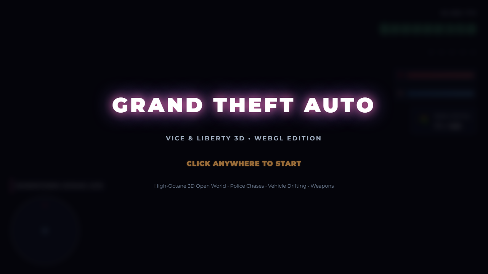

# GTA: Vice & Liberty 3D (WebGL Edition)



An action-packed 3D GTA open-world game built from the ground up for modern web browsers using Three.js, WebGL, and the Web Audio API.

## 🚀 Quick Start

Double-click **`start_game.bat`** in the `e:\games` folder!
This will automatically launch the local server and open the game in Google Chrome at `http://localhost:8000`.

Alternatively, in PowerShell/Terminal:
```powershell
cd e:\games
py -m http.server 8000
```
Then visit `http://localhost:8000` in any modern browser.

---

## 🎮 Controls

| Action | Key / Control |
|---|---|
| **Move On-Foot / Steer Vehicle** | `W`, `A`, `S`, `D` |
| **Look / Aim Camera** | `Mouse` |
| **Sprint** | `Shift` |
| **Jump (On-Foot) / Handbrake Drift (Car)** | `Space` |
| **Enter / Exit Vehicle (or Carjack Driver)** | `F` or `E` |
| **Fire Weapon / Melee Punch** | `Left Mouse Click` |
| **Aim Down Sights (Zoom)** | `Right Mouse Click` |
| **Switch Weapon** | `1`, `2`, `3`, `4`, `5` or `Mouse Wheel` |
| **Reload Weapon** | `R` |
| **Cycle Radio Stations (in vehicle)** | `R` |
| **Car Horn / Police Siren** | `H` or `E` |
| **Camera View Toggle (Third/First-person)** | `V` |
| **Controls & Pause Menu** | `H` or `ESC` |

---

## ✨ Features

- **Open-World 3D City**:
  - Multi-lane avenues, sidewalks, pedestrian crosswalks, traffic lanes.
  - 6 distinct architectural styles: glass skyscrapers with glowing windows, storefronts (Ammu-Nation, Burger Shot), brick apartments with fire escapes, industrial shipping docks with containers, gas stations, and stunt ramps.
  - Interactive props: breakable fire hydrants that blast water geysers into the sky, nighttime street lamps, trees, palms, and barriers.
  - Dynamic Day/Night Cycle with moving sun lighting, atmospheric fog, and night illumination.

- **Vehicle Dynamics & Drifting**:
  - 5 vehicle classes: Infernus Supercar, Police Interceptor, Classic Sedan, Muscle Car, Titan Truck.
  - 4-wheel raycast suspension equations with independent steering yaw and tire rolling.
  - Handbrake power-sliding and drifting with tire screech audio and smoke particles.
  - Damage and destruction system: health bar, smoke from hood when heavily damaged, and explosive destruction when destroyed.
  - Dual headlights illuminating the pavement at night, brake lights, and flashing police lightbars.

- **5-Star Wanted Level & Police AI**:
  - Crimes (carjacking, firing weapons in public, running over civilians, assaulting police) increase your Wanted Stars from 1 to 5.
  - High-speed police cruisers dispatch with sirens screaming and emergency lights flashing.
  - Tactical police officers deploy from cruisers with drawn weapons and engage in shootouts.
  - Radar evasion radius: break line of sight to start the evasion cooldown and clear your wanted stars!

- **Combat Arsenal**:
  - 1: **Fists**: Melee punch combos with knockback.
  - 2: **9mm Pistol**: Semi-auto sidearm with fast firing.
  - 3: **Micro-SMG**: High rate-of-fire submachine gun.
  - 4: **Pump Shotgun**: Heavy multi-pellet spread for close-range devastation.
  - 5: **Rocket Launcher (RPG)**: High-explosive rockets with smoke trails and area-of-effect destruction.

- **Ambient Traffic & Civilian Crowds**:
  - Autonomous traffic cars driving along roads and stopping for obstacles.
  - Walkable pedestrians that panic, scream, and flee when gunshots ring out or cars drive onto the sidewalk.
  - Pedestrians drop cash bundles (`$25` - `$85`) upon defeat.
  - Full carjacking: pull any civilian driver out onto the pavement and steal their ride!

- **GTA Missions & Objectives**:
  - Glowing 3D beacon checkpoints in the city:
    - **Mission 1: The Grand Heist**: Steal the high-performance Banshee GT from the docks, survive a 2-Star police pursuit, and deliver it to the safehouse.
    - **Mission 2: Turf War Syndicate**: Eliminate rival syndicate guards stationed at the industrial warehouse hideout.
    - **Mission 3: Neon Nitro Rush**: High-speed timed street race hitting all 5 neon checkpoints across the city before the 60s timer expires.

- **Procedural Web Audio Engine**:
  - Zero external sound files needed — 100% synthesized through HTML5 Web Audio API:
    - Dynamic engine RPM sound that scales with vehicle speed.
    - Tire screeching on hard drifts.
    - Gunshots, punch impacts, bullet sparks, explosion rumbles.
    - US/EU police siren wail.
    - 3 procedural synth radio stations (Synthwave, Hip-Hop, Driving Rock) switchable with `R`!
    - "Mission Passed" fanfare and "Wasted" slow-motion death drone.

- **Rotating Radar GPS Minimap**:
  - Circular radar HUD showing road layout, player position and heading, vehicle markers, flashing red/blue police blips, and mission objective beacons.
